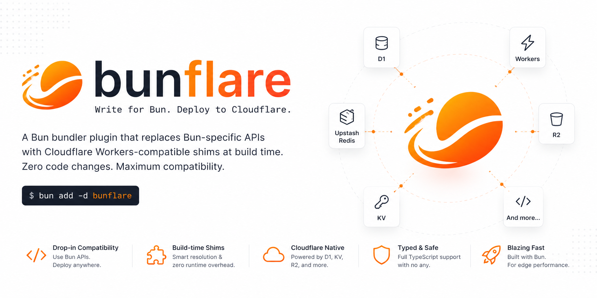

<p align="center">
  
</p>

<p align="center">
  <a href="https://npmjs.com/package/bunflare"></a>
  <a href="https://bun.sh"></a>
  <a href="https://developers.cloudflare.com/workers/"></a>
  
  
</p>

---

> **Write Bun. Deploy Cloudflare.**
>
> Bunflare is a Bun bundler plugin that automatically replaces Bun-native APIs with their Cloudflare Workers equivalents **at build time**. Zero code changes, maximum compatibility.

---

## 🤔 Why Bunflare?

You love Bun. The DX is amazing — fast builds, great APIs, no boilerplate. You write `Bun.serve`, `bun:sqlite`, `Bun.password.hash()`, and life is good.

Then you try to deploy to Cloudflare Workers. And Bun is... not there.

```
ReferenceError: Bun is not defined
```

Ouch. 😬

**Bunflare fixes that.** It runs at build time and automatically transforms all your `Bun.*` calls into their Cloudflare-native equivalents — D1, KV, R2, WebCrypto, and more. Your source code stays clean and Bun-idiomatic. The bundled output is 100% Workers-compatible.

No runtime overhead. No vendor lock-in. Just write Bun, deploy Cloudflare.

---

## ✨ What Gets Shimmed

| Bun API | Cloudflare Equivalent | Status |
|---|---|---|
| `Bun.env` | Worker `env` bindings | ✅ Done |
| `bun:sqlite` / `new Database()` | Cloudflare **D1** | ✅ Done |
| `bun:kv` / `new KV()` | Cloudflare **KV Namespace** | ✅ Done |
| `Bun.redis()` / `Bun.RedisClient` | Cloudflare **KV** (Redis-over-KV bridge) | ✅ Done |
| `Bun.password.hash/verify` | **WebCrypto** (PBKDF2) | ✅ Done |
| `Bun.hash()` | **WebCrypto** (SHA-256) | ✅ Done |
| `Bun.file()` / `Bun.write()` | Cloudflare **R2** | ✅ Done |
| `Bun.serve()` + `routes` | Cloudflare **Worker fetch handler** | ✅ Done |
| Fullstack HTML/SPA Build | Cloudflare **Workers Assets** | ✅ Done |

---

## 🚀 Quick Start

### 1. Install

```bash
bun add -d bunflare
```

### 2. Configure your build (Optional)

Create a `bunflare.config.ts` at the root of your project. **Note:** Bunflare automatically discovers your bindings from `wrangler.jsonc`, so this file is often optional or very minimal!

```ts
// bunflare.config.ts
import type { BunflareConfig } from "bunflare";

export default {
  entrypoint: "./index.ts",
  
  // Optional: Only needed if you want to override auto-discovery
  // sqlite: { binding: "DB" }, 
  // kv:     { binding: "MY_CACHE" },
  // r2:     { binding: "MY_BUCKET" },
  
  frontend: {
    entrypoint: "./public/index.html",
    outdir: "./dist/public",
  }
} satisfies BunflareConfig;
```

### 3. TypeScript Setup (Critical)

To get full type safety for `Bun.env` and Cloudflare bindings, you need a `global.d.ts` and a proper `tsconfig.json`.

**Create `global.d.ts`:**

```ts
// global.d.ts
namespace Bun {
  // Merges Cloudflare Bindings into the global Bun.env object
  interface Env extends CloudflareBindings { }
}

// This interface is automatically populated by 'wrangler types'
// into worker-configuration.d.ts
interface CloudflareBindings extends BunflareEnv { }

interface BunflareEnv {
  ASSETS: { fetch(request: Request): Promise<Response> };
  [key: string]: any;
}
```

**Generate Types:**

Run the following command to generate `worker-configuration.d.ts` based on your `wrangler.jsonc`:

```bash
bun run cf-typegen  # bunx wrangler types --env-interface CloudflareBindings
```

**Update `tsconfig.json`:**

```json
{
  "compilerOptions": {
    "types": ["bun"],
    "moduleResolution": "bundler",
    "jsx": "react-jsx",
    "strict": true
  },
  "include": [
    "global.d.ts", 
    "worker-configuration.d.ts", 
    "src/**/*"
  ]
}
```

### 4. Update your `package.json` scripts

```json
{
  "scripts": {
    "dev":    "bunflare dev",
    "build":  "bunflare build",
    "deploy": "bunflare deploy"
  }
}
```

### 5. Wire up `wrangler.jsonc`

```jsonc
// wrangler.jsonc
{
  "name": "my-app",
  "main": "dist/index.js",
  "compatibility_date": "2025-02-24",
  "d1_databases": [
    { "binding": "DB", "database_name": "my-db", "database_id": "..." }
  ],
  "kv_namespaces": [
    { "binding": "MY_CACHE", "id": "..." }
  ],
  "r2_buckets": [
    { "binding": "MY_BUCKET", "bucket_name": "my-bucket" }
  ],
  "assets": {
    "directory": "dist/public"
  }
}
```

### 5. Write your Worker like you're writing Bun

```ts
// index.ts
import { Database } from "bun:sqlite";
import { KV } from "bun:kv";

export default Bun.serve({
  routes: {
    "/api/hello": async (req) => {
      // bun:sqlite → D1 at deploy time
      const db = new Database("DB");

      // bun:kv → KV Namespace at deploy time
      const cache = new KV();
      await cache.set("greeting", "Hello from Cloudflare!");
      const greeting = await cache.get("greeting");

      return Response.json({ greeting });
    }
  },
  development: true // enables live-reload in dev mode
});
```

That's it. `bun run dev` and you're cooking. 🔥

---

## 🧠 How It Works

Bunflare hooks into Bun's bundler via a **plugin**. When you run `bunflare build`, two things happen:

1. **Virtual Module Resolution**: All `bun:*` imports (like `bun:sqlite`, `bun:kv`) are intercepted and replaced with Bunflare's own shim implementations that call Cloudflare APIs instead.

2. **Global AST Transformation**: Any reference to `Bun.*` in your source files (like `Bun.serve()`, `Bun.env`, `Bun.file()`) gets a global preamble injected that maps them to the correct Cloudflare primitives.

The end result is a bundled `dist/index.js` that is 100% Cloudflare Workers-compatible, with no trace of Bun-specific APIs at runtime.

```
Your Code (Bun)         →  Bunflare Build  →  Cloudflare Worker
─────────────────────────────────────────────────────────────────
bun:sqlite              →   shim + D1       →  env.DB.prepare(...)
bun:kv                  →   shim + KV       →  env.MY_CACHE.put(...)
Bun.redis()             →   KV bridge       →  env.MY_CACHE.get/put(...)
Bun.file() / Bun.write  →   R2 shim         →  env.MY_BUCKET.get/put(...)
Bun.password.hash()     →   WebCrypto       →  crypto.subtle.digest(...)
Bun.serve({ routes })   →   fetch handler   →  export default { fetch }
```

---

## ⚡ Smart Auto-Discovery

Bunflare is designed to be **Zero Config**. When you run `dev`, `build`, or `deploy`, it automatically parses your `wrangler.jsonc` to find your bindings.

- **SQLite**: Automatically uses your first D1 database.
- **KV / Redis**: Automatically uses your first KV namespace.
- **R2**: Automatically uses your first R2 bucket.

You only need to define these in `bunflare.config.ts` if you have multiple bindings and want to specify which one Bun should use as the default.

---

## 📖 API Reference

### `Bun.serve()` → Cloudflare Fetch Handler

Bunflare transforms `Bun.serve()` into a proper Cloudflare Worker export. All routing logic is preserved.

```ts
export default Bun.serve({
  // Route handlers work just like in Bun
  routes: {
    "/api/users": async (req) => {
      return Response.json([{ id: 1, name: "Alice" }]);
    },

    // URL params supported via URLPattern
    "/api/users/:id": async (req) => {
      const { id } = req.params;
      return Response.json({ id });
    },

    "/api/data": {
      // HTTP method handlers
      GET:  async (req) => Response.json({ action: "get" }),
      POST: async (req) => Response.json({ action: "post" }),
    }
  },

  // Fallback fetch handler
  fetch: async (req) => {
    return new Response("Not Found", { status: 404 });
  },

  // Enables live-reload script injection in dev mode
  development: true
});
```

> **💡 Tip:** Unknown routes automatically fall through to your Cloudflare Workers Assets (your frontend), so you get SPA routing for free if you configure `assets` in `wrangler.jsonc`.

---

### `bun:sqlite` → Cloudflare D1

Write SQLite-style database code and deploy to D1. The API is intentionally Bun-idiomatic.

```ts
import { Database } from "bun:sqlite";

// Connect to D1 using the binding name from wrangler.jsonc
const db = new Database("DB");

// Queries work the same way
const stmt = db.query("SELECT * FROM users WHERE active = ?");
const users = stmt.all(1); // ⚠️ See note below

// Runs fire-and-forget (async under the hood on D1)
db.run("INSERT INTO users (name, email) VALUES (?, ?)", "Alice", "alice@example.com");
```

> **⚠️ Important:** D1 is async by nature, while `bun:sqlite` is synchronous. Bunflare handles this transparently for `db.run()`, but `stmt.all()` will throw an error in the Cloudflare environment — you'll need to refactor those calls to use `db.query(...).all(...)` with async/await via the D1 client directly. This is a known limitation we're working on in the roadmap.

**Config:**
```ts
bunflare({ sqlite: { binding: "DB" } })
```

---

### `bun:kv` → Cloudflare KV

A drop-in replacement for Bun's upcoming KV API using Cloudflare KV Namespaces under the hood.

```ts
import { KV } from "bun:kv";

const cache = new KV();

await cache.set("key", "value");
const value = await cache.get("key");   // "value"
await cache.delete("key");
```

**Config:**
```ts
bunflare({ kv: { binding: "MY_CACHE" } })
```

---

### `Bun.redis()` → Redis-over-KV Bridge ⚡

This is one of Bunflare's most creative features. You get a Redis-compatible API backed by Cloudflare KV. Perfect for rate-limiting, counters, caching, and session management — without any external Redis instance.

```ts
// @ts-ignore — types coming soon!
const redis = Bun.redis();

// Basic CRUD
await redis.set("user:1:name", "Alice");
const name = await redis.get("user:1:name"); // "Alice"
await redis.del("user:1:name");

// Atomic counters (great for rate limiting or visitor counts!)
await redis.incr("page:views");   // 1
await redis.incr("page:views");   // 2
await redis.decr("page:views");   // 1

// Key existence check
const exists = await redis.exists("user:1:name"); // false

// TTL / Expiration (in seconds)
await redis.setex("session:abc123", 3600, "user_data_json");
await redis.expire("session:abc123", 7200); // extend TTL
```

**Config:**
```ts
bunflare({ redis: { binding: "MY_CACHE" } })
```

> **💡 Redis-over-KV uses the same binding as `kv`.** You can point both to the same KV namespace — they're perfectly compatible.

---

### `Bun.file()` & `Bun.write()` → Cloudflare R2

File operations map directly to R2 object storage. Same API, infinite scale.

```ts
// Write a file to R2
await Bun.write("uploads/profile.png", imageBuffer);
await Bun.write("config.json", JSON.stringify({ key: "value" }));

// Read a file from R2
const file = Bun.file("uploads/profile.png");
const text    = await file.text();
const buffer  = await file.arrayBuffer();
const json    = await file.json();
const exists  = await file.exists(); // true/false
```

**Config:**
```ts
bunflare({ r2: { binding: "MY_BUCKET" } })
```

---

### `Bun.password` → WebCrypto

Password hashing and verification using the Web Crypto API (PBKDF2 under the hood). Works identically in both Bun and Cloudflare Workers.

```ts
// Hash a password
const hash = await Bun.password.hash("my-super-secret-password");
// → "a7b3c9..." (SHA-256 hex, compatible with Workers)

// Verify it later
const isValid = await Bun.password.verify("my-super-secret-password", hash);
// → true

const isWrong = await Bun.password.verify("wrong-password", hash);
// → false
```

No config needed — the crypto shim is always included automatically.

---

### `Bun.hash()` → WebCrypto SHA-256

Generic data hashing, useful for generating ETags, content fingerprints, or cache keys.

```ts
const hash = await Bun.hash("some data or a Buffer");
// → "2cf24dba5fb..." (hex string)
```

---

### `Bun.env` → Worker Bindings

Environment variables work transparently. In Workers, they come from your `wrangler.jsonc` secrets and bindings. In Bun, they come from `.env`.

```ts
// Works in both Bun and Cloudflare Workers!
const apiKey = Bun.env.MY_API_KEY;
const isDev  = Bun.env.NODE_ENV === "development";
```

---

## 🛠️ CLI Reference

The `bunflare` CLI is the heart of your development workflow.

### `bunflare dev`

Starts the development server with live-reload.

```bash
bun run dev   # → bunflare dev
```

Under the hood, this starts `wrangler dev --live-reload`. The live-reload script is automatically injected into your HTML responses when `development: true` is set in `Bun.serve()`.

> **💡 For the best DX**, add a `build` section to your `wrangler.jsonc` to let Wrangler manage automatic rebuilds on file save:
>
> ```jsonc
> {
>   "build": {
>     "command": "bunflare build",
>     "watch_dir": "./src"
>   }
> }
> ```
>
> This way, every time you save a file, `bunflare build` runs automatically and Wrangler detects the new `dist/index.js` to hot-reload.

### `bunflare build`

Runs a full production build: Worker bundle + Frontend assets.

```bash
bun run build   # → bunflare build
```

Output:
```
🚀 building fullstack app...
  ↳ sqlite shim enabled -> D1: DB
  ↳ kv     shim enabled -> binding: MY_CACHE
    ⚡ redis bridge active
  ↳ r2     shim enabled -> binding: MY_BUCKET
  ↳ assets configured -> ./public/index.html
✓ build successful at 4:20:00 PM
```

### `bunflare deploy`

Builds for production and deploys to Cloudflare in one shot.

```bash
bun run deploy   # → bunflare deploy
```

Output:
```
🚀 preparing production build...
✓ build successful at 4:25:00 PM
📦 build ready for cloudflare
  [wrangler output here...]
```

---

## 🏗️ Fullstack Architecture

Bunflare is designed for fullstack apps. Here's the recommended project structure:

```
my-app/
├── index.ts              # Worker entry point (Bun.serve with routes)
├── src/
│   ├── App.tsx           # React/Vue/Svelte frontend
│   └── ...
├── public/
│   └── index.html        # HTML entry point for the SPA
├── dist/                 # Generated (don't commit this!)
│   ├── index.js          # Compiled Worker
│   └── public/           # Compiled frontend assets
├── bunflare.config.ts    # Bunflare configuration
├── wrangler.jsonc        # Cloudflare configuration
└── package.json
```

**`bunflare.config.ts`** — the control center:
```ts
import type { BunflareConfig } from "bunflare";

export default {
  entrypoint: "./index.ts",
  sqlite: { binding: "DB" },
  kv:     { binding: "CACHE" },
  redis:  { binding: "CACHE" }, // same binding, both work!
  r2:     { binding: "STORAGE" },
  frontend: {
    entrypoint: "./public/index.html",
    outdir:     "./dist/public",
  }
} satisfies BunflareConfig;
```

**`wrangler.jsonc`** — the Cloudflare config:
```jsonc
{
  "name": "my-app",
  "main": "dist/index.js",
  "compatibility_date": "2025-02-24",
  "d1_databases": [
    { "binding": "DB", "database_name": "my-db", "database_id": "..." }
  ],
  "kv_namespaces": [
    { "binding": "CACHE", "id": "..." }
  ],
  "r2_buckets": [
    { "binding": "STORAGE", "bucket_name": "my-storage" }
  ],
  "assets": {
    "directory": "dist/public"
  },
  "build": {
    "command": "bunflare build",
    "watch_dir": "./src"
  }
}
```

---

## 🔌 Using the Plugin Directly (Advanced)

If you prefer to manage the build yourself, you can use the `bunflare` plugin directly in your `Bun.build` call:

```ts
// build.ts
import { bunflare } from "bunflare";

await Bun.build({
  entrypoints: ["./index.ts"],
  outdir: "./dist",
  target: "browser",
  format: "esm",
  plugins: [
    bunflare({
      sqlite: { binding: "DB" },
      kv:     { binding: "CACHE" },
      redis:  { binding: "CACHE" },
      r2:     { binding: "STORAGE" },
      frontend: {
        entrypoint: "./public/index.html",
        outdir: "./dist/public",
      }
    })
  ],
});
```

---

## 💡 Real-World Recipes

### Visitor Counter with Redis

```ts
// index.ts
export default Bun.serve({
  routes: {
    "/api/counter": async (req) => {
      const redis = Bun.redis();
      const key = "global:visitors";

      if (req.method === "POST") {
        const count = await redis.incr(key);
        return Response.json({ count });
      }

      const count = await redis.get(key) || "0";
      return Response.json({ count: parseInt(count) });
    }
  }
});
```

### File Upload to R2

```ts
"/api/upload": async (req) => {
  if (req.method !== "POST") {
    return new Response("Method Not Allowed", { status: 405 });
  }

  const formData = await req.formData();
  const file = formData.get("file") as File;

  if (!file) {
    return new Response("No file provided", { status: 400 });
  }

  // This maps to R2.put() at runtime!
  await Bun.write(file.name, file);

  const saved = Bun.file(file.name);
  const exists = await saved.exists();

  return Response.json({
    success: true,
    filename: file.name,
    size: file.size,
    exists,
    message: "Uploaded to R2! 🎉"
  });
}
```

### User Auth with Password Hashing

```ts
"/api/register": async (req) => {
  const { email, password } = await req.json<{ email: string; password: string }>();

  // Hashed with WebCrypto — safe in Workers!
  const hashedPassword = await Bun.password.hash(password);

  const db = new Database("DB");
  db.run(
    "INSERT INTO users (email, password_hash) VALUES (?, ?)",
    email,
    hashedPassword
  );

  return Response.json({ success: true });
},

"/api/login": async (req) => {
  const { email, password } = await req.json<{ email: string; password: string }>();
  const db = new Database("DB");

  const user = db.query("SELECT * FROM users WHERE email = ?").get(email) as any;
  if (!user) {
    return new Response("Unauthorized", { status: 401 });
  }

  const valid = await Bun.password.verify(password, user.password_hash);
  if (!valid) {
    return new Response("Unauthorized", { status: 401 });
  }

  return Response.json({ success: true, userId: user.id });
}
```

### Rate Limiting with Redis TTL

```ts
"/api/sensitive-action": async (req) => {
  const redis = Bun.redis();
  const ip = req.headers.get("cf-connecting-ip") || "unknown";
  const rateLimitKey = `rate:${ip}`;

  const attempts = await redis.incr(rateLimitKey);

  if (attempts === 1) {
    // First attempt — set 1-minute window
    await redis.expire(rateLimitKey, 60);
  }

  if (attempts > 10) {
    return Response.json({ error: "Too many requests" }, { status: 429 });
  }

  // Process the action...
  return Response.json({ success: true });
}
```

---

## 🗺️ Roadmap

| Version | Goal | Status |
|---|---|---|
| `v0.1` | Foundation: env, sqlite, kv, redis, crypto | ✅ Done |
| `v0.2` | API Parity: R2, serve, fullstack HTML, live-reload | ✅ Done |
| `v0.3` | Testing: Unit + Miniflare + CI/CD | 🚧 In Progress |
| `v0.4` | DX: `bunflare init`, binding validation, better errors | 📅 Planned |
| `v0.5` | `Bun.sql` → Hyperdrive, `Bun.CryptoHasher`, UUIDv7 | 📅 Planned |
| `v1.0` | Stable npm release, full docs, VS Code extension | 📅 Planned |

---

## 🧪 Architecture Deep Dive

### The KV/Redis Shim

One of the most elegant parts of Bunflare is the Redis-over-KV bridge. The shim has a clean separation of concerns:

```
plugin/shims/kv/
├── index.ts   # Generator — reads logic.ts and injects binding name
└── logic.ts   # Pure implementation — used in both shim and unit tests
```

`logic.ts` contains the actual class implementations (`KV`, `RedisClient`) that can be imported directly in your unit tests:

```ts
// Your test file
import { RedisClient } from "../plugin/shims/kv/logic";

const mockKV = {
  get: async (key) => "mock-value",
  put: async (key, val) => {},
  delete: async (key) => {},
};

// Test the real logic with a mock KV
globalThis.env = { MY_KV: mockKV };
const redis = new RedisClient("MY_KV");
const value = await redis.get("test-key"); // "mock-value"
```

This architecture means the production shim code is also your test code — no mocking the shim itself.

### The Global Preamble Injection

For APIs like `Bun.serve`, `Bun.redis()`, and `Bun.file()` that aren't imported — they're accessed via the global `Bun` object — Bunflare injects a **preamble** at the top of every file that contains the word `Bun`:

```ts
// Auto-injected at build time:
import { redis, RedisClient } from "bunflare:kv";
import { serve } from "bunflare:serve";
import { file, write } from "bunflare:r2";
import { BunCrypto } from "bunflare:crypto";
import { env } from "bunflare:env";

if (typeof globalThis.Bun === "undefined") {
  globalThis.Bun = { redis, RedisClient, serve, file, write, ...BunCrypto, env };
}

// Your original code follows:
export default Bun.serve({ ... });
```

This is what we internally call the **"Nuclear Option"** — ensuring `Bun.*` is never undefined, regardless of the Workers environment restrictions.

---

## 🤝 Contributing

The project is structured as a Bun workspace:

```
bunflare/
├── plugin/     # The plugin source code
│   ├── index.ts          # Main plugin entry
│   ├── bin.ts            # CLI (bunflare dev/build/deploy)
│   ├── types.ts          # TypeScript types
│   ├── resolvers/        # Bun namespace resolver
│   └── shims/            # All shim implementations
│       ├── sqlite.ts     # D1 shim
│       ├── kv/           # KV + Redis shims
│       │   ├── index.ts
│       │   └── logic.ts  # Pure logic (testable!)
│       ├── r2.ts         # R2 shim
│       ├── crypto.ts     # WebCrypto shim
│       ├── env.ts        # Env shim
│       └── serve.ts      # Serve shim
├── tests/      # All tests live here
├── app/        # Example fullstack application
└── docs/       # Documentation extras
```

### Running Tests

```bash
# From the root
bun test

# Individual test files
bun test tests/redis-bridge.test.ts
bun test tests/integration.test.ts
bun test tests/shims.test.ts
```

All 22 tests should pass. 💚

---

## 📄 License

MIT © [fhorray](https://github.com/fhorray)

---

<p align="center">
  Made with ☕ and a healthy obsession with developer experience.
  <br />
  <strong>Write for Bun. Deploy to Cloudflare.</strong>
</p>
